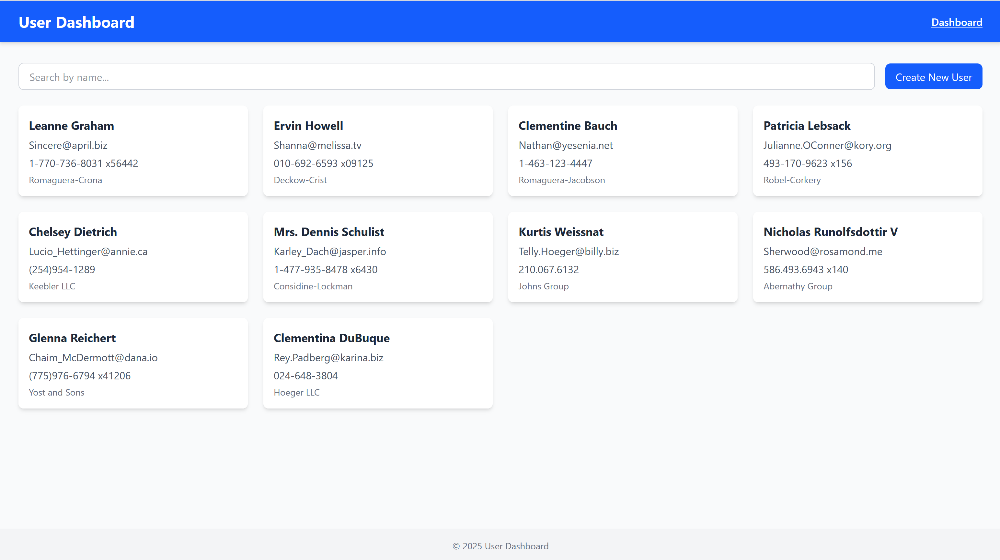
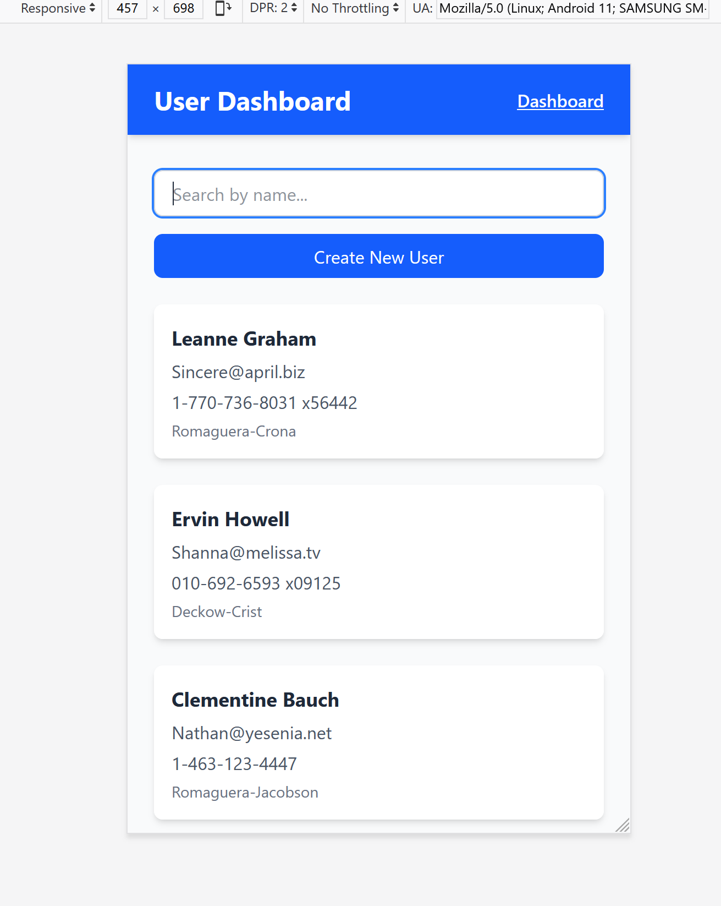
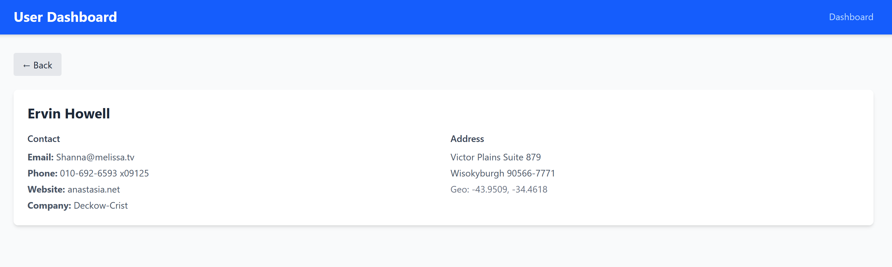
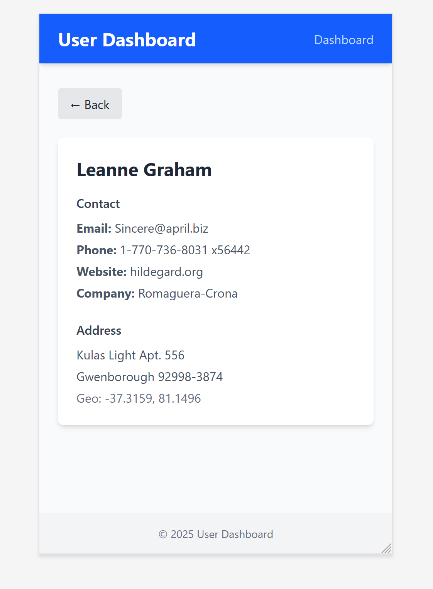
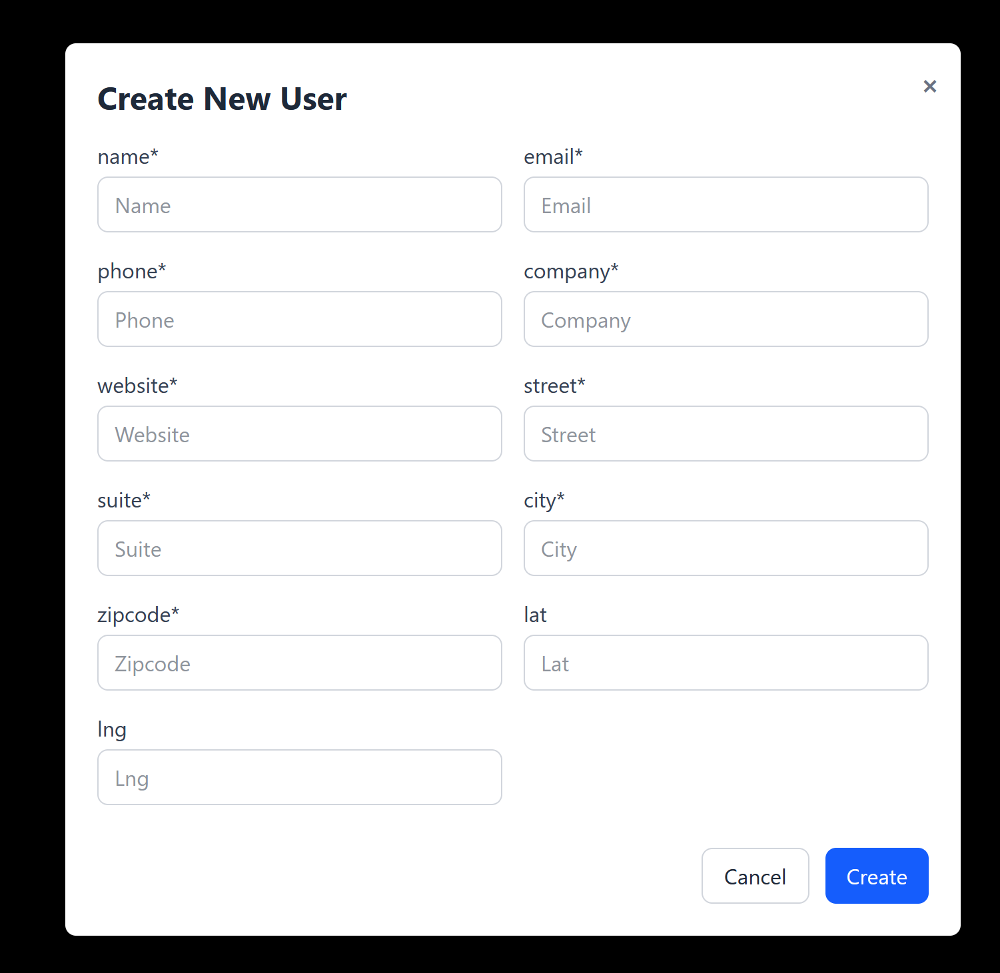
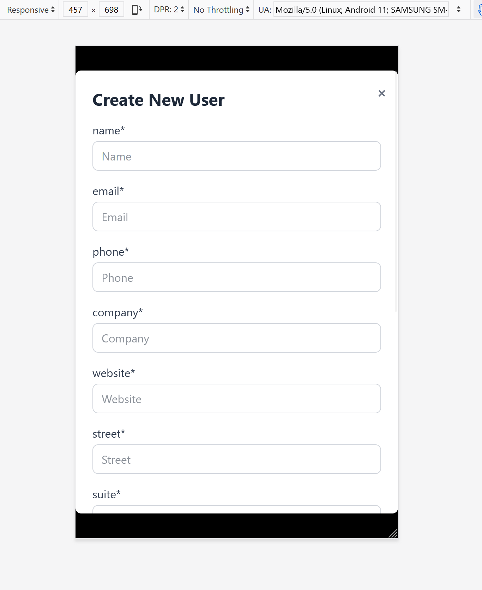

# React Frontend Intern Assignment - User Dashboard

## Objective
Build a small **User Dashboard** application using **React.js** that displays a list of users, allows searching/filtering, and shows detailed user information on a separate page.

---

## Features

### 1. Dashboard Page
- Fetches and displays a list of users using React Context.
- Displays user **name, email, phone, and company name** in a **card layout**.
- Includes **search functionality** to filter users by name.
- Provides a **"Create New User" form** (client-side only) to add new users.
- Responsive grid layout using **Tailwind CSS** for professional, modern look.

### 2. User Details Page
- Clicking on a user card navigates to the **User Details page** via **React Router**.
- Shows **full user details**, including:
  - Name, Email, Phone, Website, Company
  - Address and Geo-location

### 3. Responsive Design
- Fully responsive layout:
  - **Mobile-friendly** with single-column layouts.
  - **Desktop/tablet**: multi-column grids for cards and details.
- Styled with **Tailwind CSS** for a clean, professional look.

---

## Tech Stack
- **React.js** (functional components + hooks)
- **React Context** for global state management
- **React Router DOM** for routing
- **Tailwind CSS** for styling
- **Fetch API** for data (can be replaced with Axios if needed)

---

## Folder Structure
src/
├─ components/
│ ├─ UserCard.jsx
│ └─ UserForm.jsx
├─ context/
│ └─ UserContext.jsx
├─ pages/
│ ├─ Dashboard.jsx
│ └─ UserDetails.jsx
├─ App.jsx
└─ index.jsx

## Setup Instructions

1. **Clone the repository**

git clone <your-repo-link>
cd <repo-folder>

2. **Install dependencies**
>>npm install

3. **Run the development server**
>>npm run dev

* Open [http://localhost:5173](http://localhost:5173) in your browser.

4. **Build for production**
>>npm run build

## Usage

1.Navigate to the Dashboard page to view all users.

2.Use the search bar to filter users by name.

3.Click Create New User to add a new user (client-side only).

4.Click on any user card to view full details on the User Details page.

5.Navigate back using the Back button.

## Screenshots

### Dashboard Page
- **Desktop**

- **Mobile**

### User Details Page
- **Desktop**

- **Mobile**

### Create New User Modal
- **Desktop**

- **Mobile**

